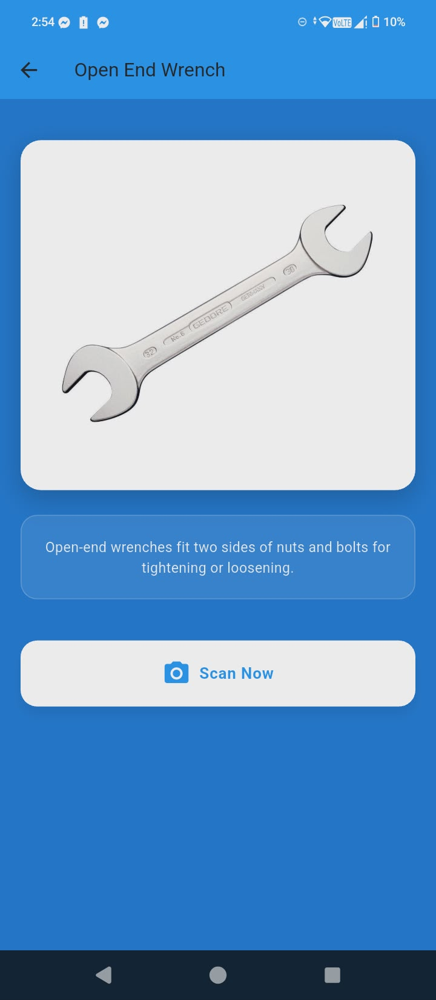
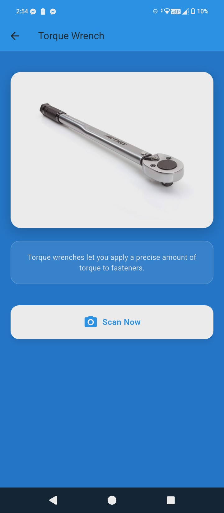
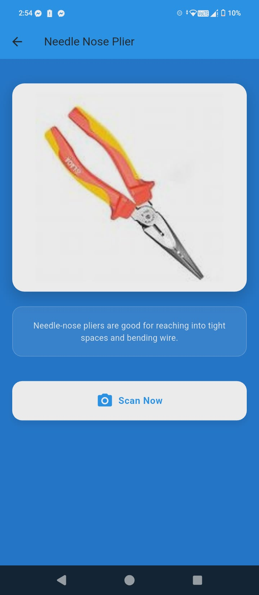
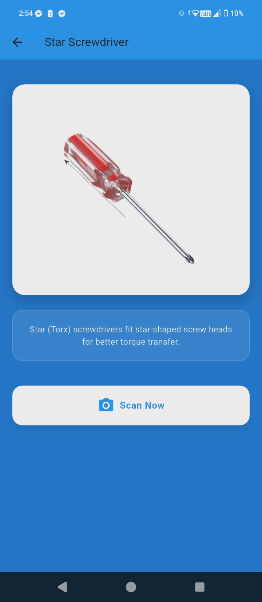
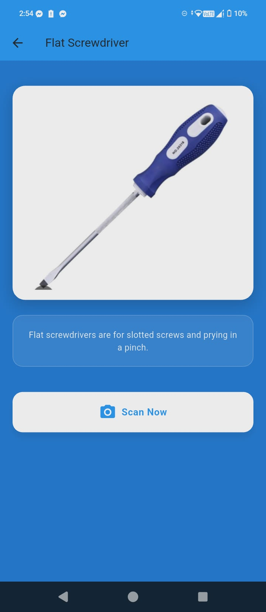
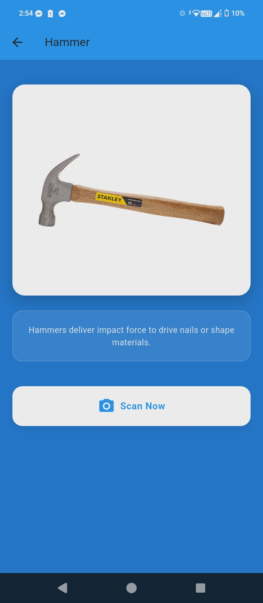
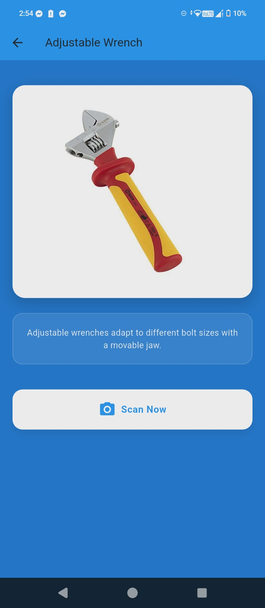

<h1 align="center">👋 WELCOME TO MY PROFILE</h1>

<h2 align="center"><strong>Sachin L. Kumar</strong></h2>

<em>IT Student</em>

---

## � About Me

I am an IT student with hands-on experience in web application development, 
and I am currently expanding my skills into mobile app development using Flutter and Firebase.
I enjoy building real-world applications, focusing on functionality, usability, and clean UI design across both web and mobile platforms.
I am passionate about learning new technologies and continuously improving my skills in software development.

---

## 🎯 Current Focus

* Building functional mobile apps using **Flutter + Firebase**
* Strengthening backend logic and database management
* Exploring modern frontend and backend development practices

---

## 🧰 Core Skills & Technologies

### 💻 Languages & Frameworks
## 🧰 Core Skills & Technologies

### 💻 Languages & Frameworks

### 🗄️ Databases

---

## 📚 Learning & Development

* Implementing authentication and CRUD features
* Understanding database structure and data flow
* Improving UI/UX design for mobile and web apps
* Writing maintainable and production-ready code

---

## ⭐ Featured Projects

### 📱 Smart Attendance System

RFID-based attendance system with scan history and statistics.

### 💼 Job Application System

A system for job seekers and employers with application tracking and resume management.

### 💎 Jewelry Shop System

An e-commerce-style system with login, product display, admin panel, and purchase features.

---

## �# �🔗 Connect With Me

* 📧 Email: xxsachinxx123@gmail.com
* 🌐 Facebook: your-facebook-link

---

## ✨ Fun Fact

I enjoy designing clean, modern, and user-friendly interfaces that make apps enjoyable to use.

---

## 🛠️ Tool Classes Overview

Below is a quick overview of the tool classes that **Tool Identifier** can recognize, with a short description and a sample screen for each class.

| Class Name         | Description                                                                                          | Sample Screen |
|--------------------|------------------------------------------------------------------------------------------------------|---------------|
| **Locking Plier**  | Versatile plier with an adjustable locking mechanism. Commonly used to firmly grip, clamp, or hold metal parts in place. |  |
| **Open End Wrench**| Wrench with U-shaped openings on one or both ends. Ideal for tightening or loosening nuts and bolts in tighter spaces. |  |
| **Torque Wrench**  | Precision wrench designed to apply a specific amount of torque to a fastener. Useful for mechanical and automotive work. |  |
| **Needle Nose Plier** | Long, narrow pliers used for gripping small objects and reaching into tight spaces. Helpful for electronics and fine repair work. |  |
| **Star Screwdriver** | Screwdriver with a star-shaped (Torx-style) tip. Commonly used for modern electronics and machinery that use star screws. |  |
| **Flat Screwdriver** | Screwdriver with a flat, straight tip. Used for slotted screws in basic repairs and general-purpose tasks. |  |

---

## 📸 App Screenshots

### 🏠 Main Screens

<table>
  <tr>
    <td></td>
    <td></td>
  </tr>
</table>

### 📂 Sidebar & Statistics

<table>
  <tr>
    <td></td>
    <td></td>
    <td></td>
  </tr>
</table>

### 📷 Scan & Upload (Bottom Section)

<table>
  <tr>
    <td></td>
    <td></td>
  </tr>
</table>

### 📑 Other Screens

<table><tr>
<td></td>
<td></td>
<td></td>
<td></td>
<td></td>
</tr><tr>
<td></td>
<td></td>
<td></td>
<td></td>
<td></td>
</tr></table>
