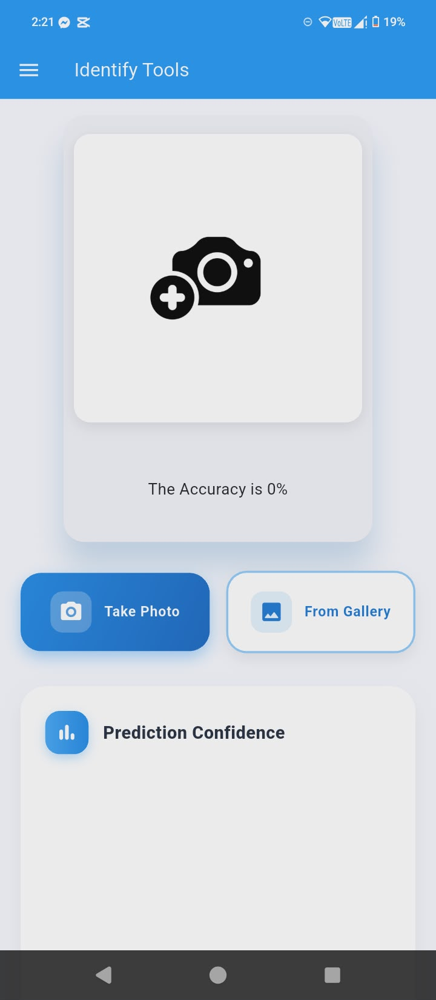
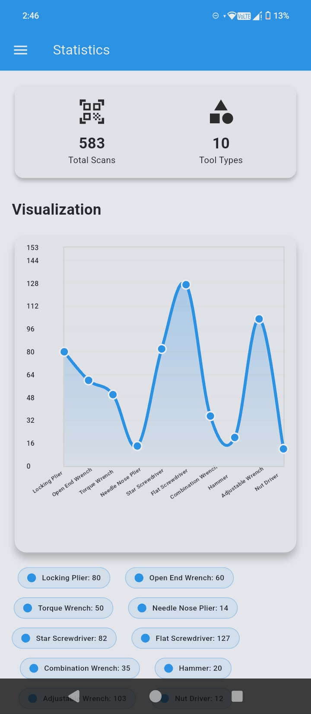
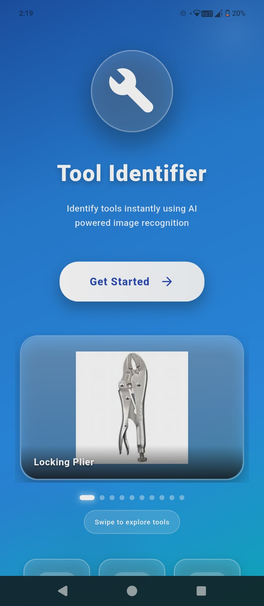
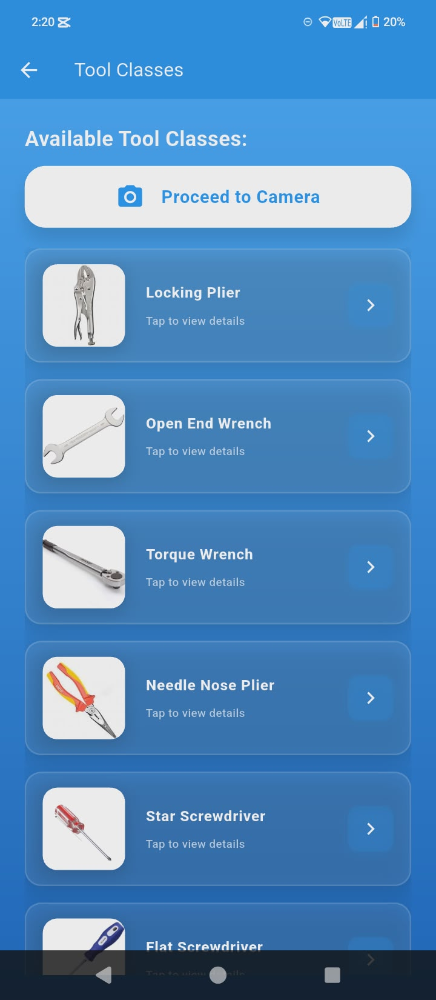
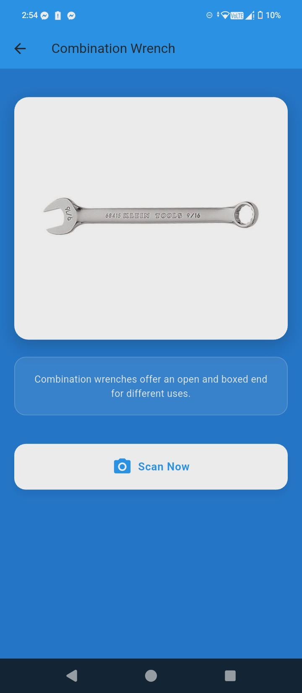
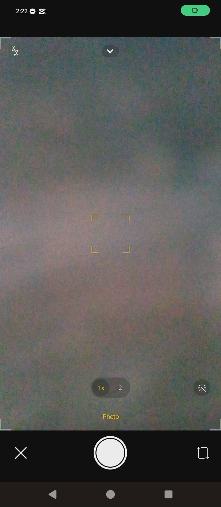
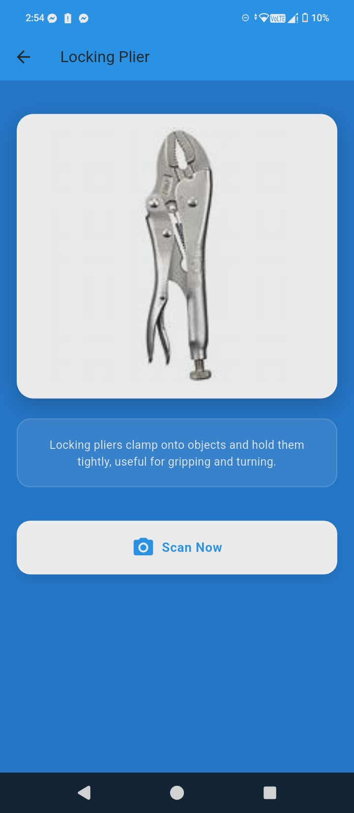

<h1 align="center">👋 WELCOME TO MY PROFILE</h1>

<h2 align="center"><strong>Sachin L. Kumar</strong></h2>

<em>IT Student</em>

---
## 📋 Table of Contents

- [About Me](#-about-me)
- [Current Focus](#-current-focus)
- [Core Skills & Technologies](#-core-skills--technologies)
- [Learning & Development](#-learning--development)
- [Featured Projects](#-featured-projects)
- [App Screenshots](#-app-screenshots)
- [Connect With Me](#-connect-with-me)
- [Fun Fact](#-fun-fact)
## � About Me

I am an IT student with hands-on experience in web application development, 
and I am currently expanding my skills into mobile app development using Flutter and Firebase.
I enjoy building real-world applications, focusing on functionality, usability, and clean UI design across both web and mobile platforms.
I am passionate about learning new technologies and continuously improving my skills in software development.

---

## 🎯 Current Focus

* Building functional mobile apps using **Flutter + Firebase**
* Strengthening backend logic and database management
* Exploring modern frontend and backend development practices

---

## 🧰 Core Skills & Technologies

### 💻 Languages & Frameworks

### 🗄️ Databases

---

## 📚 Learning & Development

* Implementing authentication and CRUD features
* Understanding database structure and data flow
* Improving UI/UX design for mobile and web apps
* Writing maintainable and production-ready code

---

## ⭐ Featured Projects

### 📱 Smart Attendance System

RFID-based attendance system with scan history and statistics.

#### Screenshots

| | | |

| --- | --- | --- |

|  Main scan screen for RFID attendance. |  History page with delete option. |  Graphical data view. |

|  Attendance metrics dashboard. |  |  |

### 💼 Job Application System

A system for job seekers and employers with application tracking and resume management.

#### Screenshots

| | | |

| --- | --- | --- |

|  Main page of the job application system. |  Application tracking page. |  Resume management interface. |

|  Navigation sidebar. |  |  |

### 💎 Jewelry Shop System

An e-commerce-style system with login, product display, admin panel, and purchase features.

#### Screenshots

| | | |

| --- | --- | --- |

|  Product display. |  Analytics dashboard. |  Product image capture. |

|  Premium category page. |  Product display. |  Product display. |

|  Product display. |  Product display. |  Product display. |

|  Product display. |  Product display. |  |

---
## 📸 App Screenshots

### Smart Attendance System Screenshots

| | | |

| --- | --- | --- |

|  Main scan screen for RFID attendance. |  History page with delete option. |  Graphical data view. |

|  Attendance metrics dashboard. |  |  |

### Tool Management App Screenshots (Assuming based on image names)

| | | |

| --- | --- | --- |

|  Adjustable tool image. |  Bar graph function. |  Camera interface. |

|  First class page. |  Initial app page. |  Flat screw tool. |

|  Hammer tool. |  Needle nose pliers. |  Nut driver tool. |

|  Open-end wrench. |  Screwdriver. |  Second app page. |

|  Side navigation bar. |  Third app page. |  Torque tool. |

---
## �# �🔗 Connect With Me

* 📧 Email: xxsachinxx123@gmail.com
* 🌐 Facebook: your-facebook-link

---

## ✨ Fun Fact

I enjoy designing clean, modern, and user-friendly interfaces that make apps enjoyable to use.
