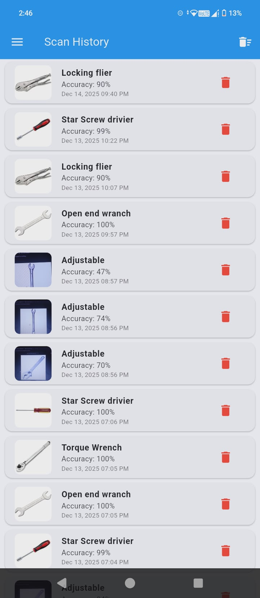
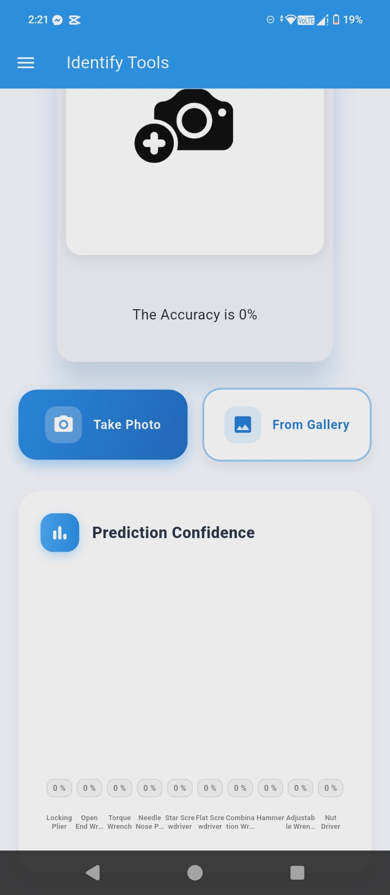
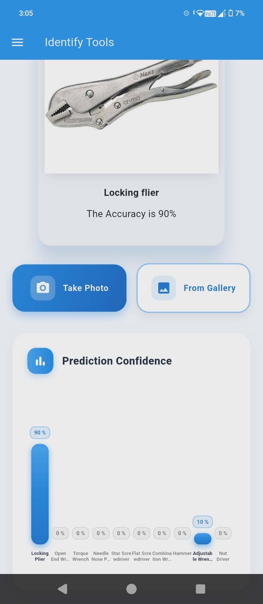
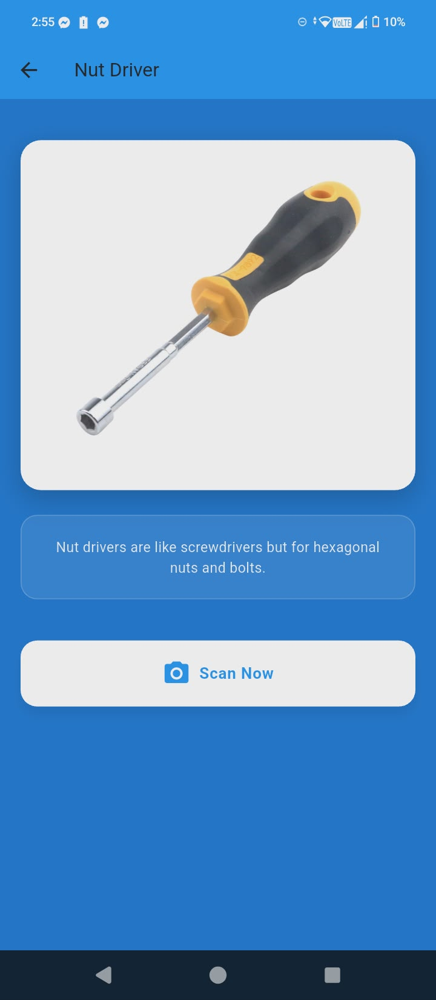
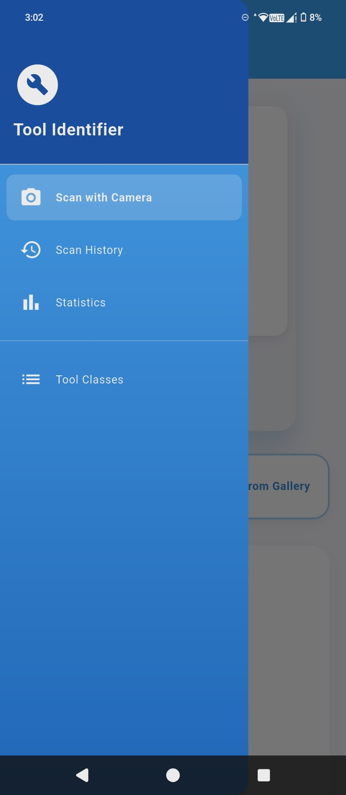

<h1 align="center">👋 WELCOME TO MY PROFILE</h1>

<h2 align="center"><strong>Sachin L. Kumar</strong></h2>

<em>IT Student</em>

---

## 🚀 About Me

I am an IT student with hands-on experience in web application development, 
and I am currently expanding my skills into mobile app development using Flutter and Firebase.
I enjoy building real-world applications, focusing on functionality, usability, and clean UI design across both web and mobile platforms.
I am passionate about learning new technologies and continuously improving my skills in software development.

---

## 🎯 Current Focus

* Building functional mobile apps using **Flutter + Firebase**
* Strengthening backend logic and database management
* Exploring modern frontend and backend development practices

---

## 🧰 Core Skills & Technologies

### 💻 Languages & Frameworks
## 🧰 Core Skills & Technologies

### 💻 Languages & Frameworks

### 🗄️ Databases

---

## 📚 Learning & Development

* Implementing authentication and CRUD features
* Understanding database structure and data flow
* Improving UI/UX design for mobile and web apps
* Writing maintainable and production-ready code

---

## ⭐ Featured Projects

### 📱 Smart Attendance System

RFID-based attendance system with scan history and statistics.

### 💼 Job Application System

A system for job seekers and employers with application tracking and resume management.

### 💎 Jewelry Shop System

An e-commerce-style system with login, product display, admin panel, and purchase features.

---

## � App Screenshots

### Smart Attendance System Screenshots

This screenshot displays the primary scan interface of the Smart Attendance System, where users scan their RFID cards to record attendance.

Here, you can see the scan history page, allowing users to view past scans and delete entries if necessary.

This image shows a graphical view of scan data, perhaps a white-themed graph for better visibility.

The statistics page provides insights into attendance patterns with charts and metrics.

### Tool Management App Screenshots (Assuming based on image names)

A screenshot of an adjustable tool, possibly part of an inventory or catalog app.

This shows a bar graph function, likely displaying data in a visual format.

The camera interface, perhaps for capturing images in the app.

First class or category page.

The initial page of the app.

Image of a flat screw tool.

Hammer tool screenshot.

Needle nose pliers.

Nut driver tool.

Open-end wrench.

Screwdriver.

Second page of the app.

The side navigation bar.

Third page.

Torque tool or setting.

---

## �🔗 Connect With Me

* 📧 Email: xxsachinxx123@gmail.com
* 🌐 Facebook: your-facebook-link

---

## ✨ Fun Fact

I enjoy designing clean, modern, and user-friendly interfaces that make apps enjoyable to use.
